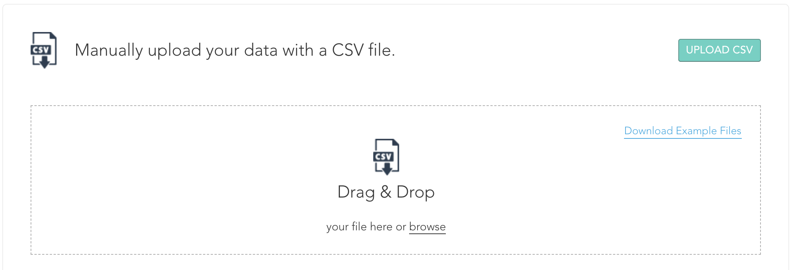

# CSV Upload

## File Formatting

* Values must be `UTF-8` encoded
* Values must be comma delimited
* Records must end with a newline \(`\n`\)
* Any value may be optionally quoted via double quote \(`"`\) characters
* Any field containing a double quote must be quoted. The escape character for an embedded quote is a second quote character. \(For example: `"Customers think this product is ""Amazing!"""`\)
* Each record must contain exactly the same number of fields as the header does
* No carriage return \(`\r`\) or newline \(`\n`\) may exist within a record
* Date / Time fields must be formatted as follows:

<table>
  <thead>
    <tr>
      <th style="text-align:left">Date Format</th>
      <th style="text-align:left">Examples</th>
    </tr>
  </thead>
  <tbody>
    <tr>
      <td style="text-align:left">Unix Timestamp / Epoch</td>
      <td style="text-align:left"><code>1435708800</code>
      </td>
    </tr>
    <tr>
      <td style="text-align:left"><a href="https://en.wikipedia.org/wiki/ISO_8601">ISO 8601</a>
      </td>
      <td style="text-align:left">
        
<code>2019-04-11T18:43:29+00:00</code>
        

        
<code>2019-04-11T18:43:29Z</code>
        

        
<code>2019-04-11</code>
        

      </td>
    </tr>
    <tr>
      <td style="text-align:left">%Y-%m-%d %H:%M:%S%:z</td>
      <td style="text-align:left"><code>2014-09-01 13:34:08+00:00</code>
      </td>
    </tr>
    <tr>
      <td style="text-align:left">%Y-%m-%d %H:%M:%S</td>
      <td style="text-align:left"><code>2014-09-01 13:34:08</code>
      </td>
    </tr>
    <tr>
      <td style="text-align:left">&apos;%m/%d/%y %H:%M</td>
      <td style="text-align:left"><code>09/01/14 13:34</code>
      </td>
    </tr>
    <tr>
      <td style="text-align:left">%m/%d/%y %H:%M:%S</td>
      <td style="text-align:left"><code>09/01/14 13:34:08</code>
      </td>
    </tr>
    <tr>
      <td style="text-align:left">%m/%d/%Y %H:%M:%S</td>
      <td style="text-align:left"><code>09/01/2014 13:34:08</code>
      </td>
    </tr>
    <tr>
      <td style="text-align:left">%m/%d/%Y %H:%M</td>
      <td style="text-align:left"><code>09/01/2014 13:34</code>
      </td>
    </tr>
  </tbody>
</table>
If time and time zone are not provided the time is assumed be 12am UTC.


## Error Handling

Any record that contains an invalid field will be ignored. If more than 1% of the data is invalid, the entire file will be rejected. The Activity Log will show the status of the uploads, any errors generated, and a success entry if the data is loaded successfully.

## File Naming

| Object | File Name Prefix |
| :--- | :--- |
| Products | `zaius_products` |
| Customers | `zaius_customers` |
| Orders | `zaius_orders` |
| Events | `zaius_events` |
| Lists | `zaius_list` |

## Where to upload?

### UI

1. Go to [Account Settings -&gt; Integrations](https://app.zaius.com/?=#/integrations)
2. Select **Upload CSV -&gt; Browse**
3. Select the file that follows the file name and format conventions outlined below

#### Files can also be imported via Amazon S3:



## Examples & Samples


The files below are only basic examples. 

Refer to the Zaius schema section to learn about all available default fields and creating custom fields & objects.


### Customers



### Products



### Orders




Refer to[ Orders documentation](../zaius-schema/orders/#fields) for field descriptions and data types.


* Shared Fields
  * action
    * value should be one of `purchase | refund | return | cancel`
  * **order\_id \(REQUIRED\)**
  * **ts** **\(REQUIRED\)**
* Order Summary Fields
  * total
  * discount
  * subtotal
  * tax
  * shipping
  * coupon\_code
  * first\_name
  * last\_name
  * bill\_address
  * ship\_address


Order Line Item fields \(and the associated events\) cannot be updated in the future, only summary fields \(for refunds, returns, cancellations\).


* Order Line Item Fields \(one row per line item\) - unavailable for `refund`, `return` & `cancel`
  * item\_product\_id
  * item\_sku
  * item\_price
  * item\_quantity
  * item\_discount
  * item\_subtotal


Prefix all custom event fields with `item_` to indicate the field exists on the Event object, otherwise it will be assumed you attempting to update the Orders object.


### Events



### Lists


**Uploading a List file without an "action" column assumes a subscription for each email**


#### Upload to Single List



**Upload to Multiple Lists**



### Custom Objects


Replace `customobject` with the name of the custom object





All custom object updates must include the primary key \(or keys in the case of composite keys\) in the file \(e.g. `id`\)


