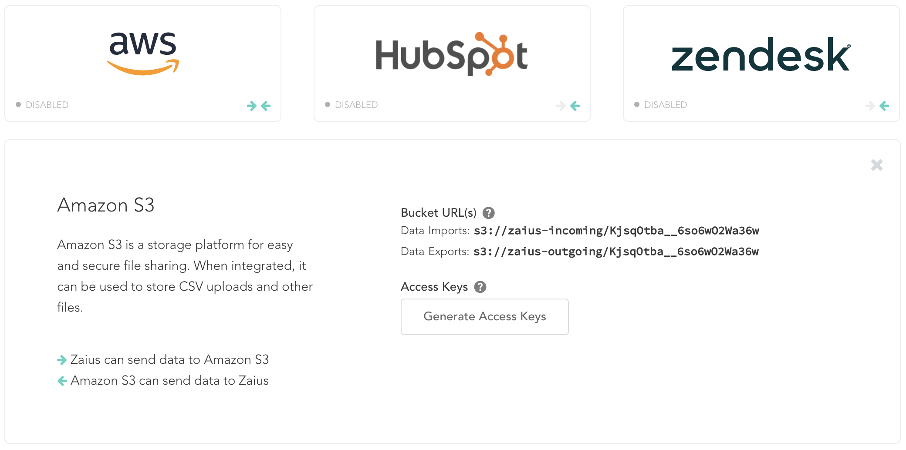

# Google Cloud Storage

## 1. Export: Zaius to Amazon S3

Using the Zaius Export API you can export all data from Zaius to an Amazon S3 bucket. 

### Example



```bash
#!/bin/sh
curl -X POST \
  'https://api.zaius.com/v3/exports' \
  -d '{
    "objects": [
      "events",
      "customers",
      "orders",
      "products",
      "categories",
      "lists",
      "list_members",
      "customer_observations",
      "customer_insights",
      "product_insights",
      "category_insights"
    ],
    "format": "parquet"
  }' \
  -H 'Content-Type: application/json' \
  -H 'x-api-key: YOURKEYHERE'
```



#### Make Script Executable

```bash
chmod +x zaius-export.sh
```

### Schedule Export

#### Edit Crontab

```bash
crontab -e
```

#### Add Script to Crontab



```bash
@daily /path/to/your/script/zaius-export.sh
```



## 2. Import: S3 to Google

### Generate S3 Bucket & Credentials

1. Go to [Account Settings -&gt; Administration -&gt; Integrations](https://app.zaius.com/app?#/integrations)

2. Select the AWS tile

3. Select "Generate Access Keys"



### Create a Google Cloud Bucket

1. Go to [Google Cloud Storage](https://console.cloud.google.com/storage/browser)

2. Create a Bucket


### Transfer Files

1. [Install gsutil](https://cloud.google.com/storage/docs/quickstart-gsutil)

2. Ensure you have generated an authentication file

```bash
gcloud config set pass_credentials_to_gsutil false
```

```bash
gsutil config
```

3. After you run the `config` command, you'll see this in your `~/.boto` file:

```text
# To add aws credentials ("s3://" URIs), edit and uncomment the
# following two lines:
# aws_access_key_id = 
# aws_secret_access_key = 
```

4. Execute



```bash
gsutil -m cp -R s3://zaius-outgoing/{INSERT-TRACKER-HERE}/data-exports gs://zaius-example-export
```




