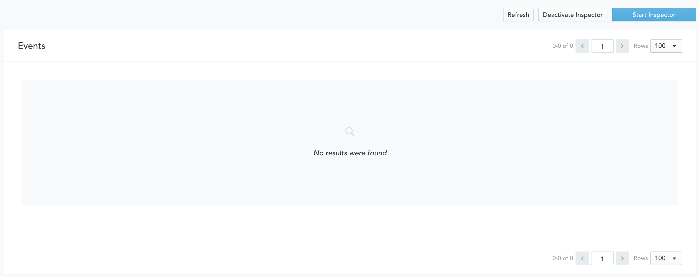

# Event Inspector

Since every data update in Zaius results in underlying events, the **Event Inspector** is a helpful way to troubleshoot data as it comes into Zaius. 


Although customer and object updates are processed as events, the events are not stored.


The Event Inspector is located at [Account Settings -&gt; Event Inspector](https://app.zaius.com/app?=#/event_inspector).

To start monitoring for incoming events, select **Start Inspector**. Events will start being collected and the table can display the latest collected data by clicking **Refresh**. 

